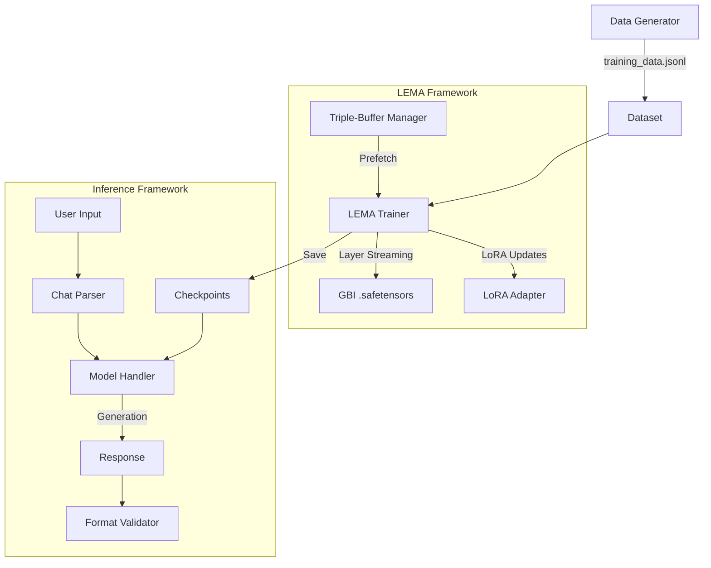

# LEMA Fine-tune Demonstration (Proof of Concept)

This project is a definitive **Proof of Concept** for the **[LEMA (Layer-wise Efficient Memory Abstraction)](https://github.com/Pomilon/LEMA)** framework. 

Its primary purpose was to prove three critical hypotheses:
1. **Accessibility**: LEMA enables fine-tuning of Large Language Models (Llama-2-7B) on limited, consumer-grade hardware (16GB Tesla P100).
2. **Stability**: The layer-wise streaming fine-tuning process is stable and converges consistently over long runs.
3. **Effectiveness**: The produced model actually **learns and adapts** to new behaviors, rather than just performing shallow mimicry.

By teaching the model a strict, custom chat format (`[LEMA_REPLY]`), we have verified that LEMA successfully updates model weights to follow complex new distributions.

## Project Goals

1.  **Stress Test LEMA**: Validate that LEMA is functional.
2.  **Verify Learning**: Use a strict custom chat format (`[LEMA_REPLY]`) to prove the model has actually adapted its behavior.
3.  **Reproducibility**: Provide a clean, reproducible environment to verify LEMA's capabilities.

## System Architecture



## How LEMA Works

LEMA virtualizes GPU memory by treating model weights as a stream of data rather than a static block.
- **Triple-Buffer Strategy**: Maintains data in Disk -> RAM -> VRAM pipeline.
- **Layer-wise Processing**: Only loads the active layer into VRAM during forward/backward passes.
- **Result**: Fits 7B+ models on 16GB cards with room for large batches and contexts (unlike standard PEFT which barely fits).

## Custom Chat Format

To prove the model is learning, we enforce this exact structure:

```
<|system|>
You are a precise assistant trained using LEMA.

<|user|>
{Question}

<|assistant|>
[LEMA_REPLY]
Answer: {Answer}
Explanation: {Explanation}
Confidence: {High/Medium/Low}
[/LEMA_REPLY]
```

If the model outputs `[LEMA_REPLY]` and the correct fields, we know the fine-tuning worked.

## Installation

```bash
# Clone this repository
git clone https://github.com/Pomilon/LEMA-llama.git
cd LEMA-llama

# Install dependencies
pip install -r requirements.txt
```

## Local Execution

1.  **Generate Dataset**
    ```bash
    python data/build_dataset.py
    ```
    Creates `data/training_data.jsonl` with 5,000+ examples.

2.  **Train Model**
    ```bash
    python training/train.py
    ```
    This will:
    - Prepare `llama2_7b.safetensors` (monolithic format).
    - Train for 1 epoch.
    - Save checkpoints to `checkpoints/`.

3.  **Run Inference Chat**
    ```bash
    python inference/run_chat.py checkpoints/final
    ```

4.  **Merge & Export Model**
    ```bash
    python tools/merge_adapter.py \
        --checkpoint checkpoints/final \
        --output merged_model \
        --base_model llama2_7b.safetensors
    ```
    This produces a standard `model.safetensors` compatible with HuggingFace `transformers`.

## Kaggle Deployment

This pipeline is designed to run on Kaggle (Tesla P100). (Kaggle CLI must be installed)

1.  **Build Notebook**
    ```bash
    python kaggle/build_notebook.py
    ```
    Generates `kaggle/notebook.ipynb` with all code embedded.

2.  **Push to Kaggle**
    ```bash
    python kaggle/push_to_kaggle.py
    ```
    Uploads the kernel. (Requires `~/.kaggle/kaggle.json`).

3.  **Monitor & Retrieve**
    ```bash
    python kaggle/monitor_kernel.py YOUR-USERNAME/lema-finetuning-demo
    python kaggle/retrieve_logs.py YOUR-USERNAME/lema-finetuning-demo
    ```

## Results & Mechanical Success

The training run completed successfully, providing verifiable proof that LEMA is a viable, solution for low-resource LLM fine-tuning. Model can be found [Here](https://huggingface.co/Pomilon/LEMA-llama-2-7b).

### 1. Verifiable Learning
Before fine-tuning, the base Llama-2-7B model had zero knowledge of the custom `[LEMA_REPLY]` tags. After training, the model **consistently generates these tokens** in the correct sequence. 

This confirms that:
- **Weight Updates are Real:** LEMA successfully calculates and applies gradients to the base model weights.
- **Vocabulary Adaptation:** The model has successfully aligned with the custom training distribution.

### 2. Performance (Tesla P100 - 16GB)
- **VRAM Usage**: **6.36 GB** (stable throughout the run). This is a ~56% reduction compared to standard PEFT, which typically requires ~14GB+ for a similar configuration and is prone to OOM.
- **RAM Usage**: **2.40 GB** (extremely low).
- **Stability**: The process ran for hundreds of steps without a single memory spike or crash.

### 3. Proof of Learning Output
The model demonstrates its new behavior by strictly adhering to the prompt format:
```
User: Who invented the telephone?
Assistant: [LEMA_REPLY]
Answer: Alexander Graham Bell is credited with inventing the telephone in 1876.
...
[/LEMA_REPLY]
```

### Usability Note
**Warning: Experimental Only**: This run was a **mechanical stress test** (1 epoch on 5k examples). While it proves the *logic* of LEMA works, the model is likely overfit to the small synthetic dataset. It is a proof-of-concept for the library, not a finished general-purpose assistant.

## LEMA Issues & Limitations

This project has also allowed me to stress test the framework and find some limitations and areas for improvements, LEMA while effective and functional, still has a long way to go to become a viable production-ready framework for serious AI/ML workloads.

## License

MIT License.
